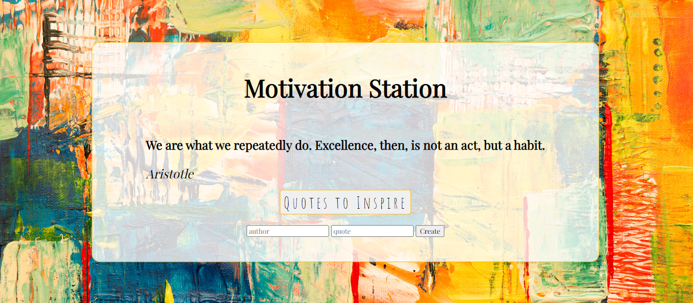

# Motivation Station Web App

Motivation Station is a web application that provides users with motivational quotes to inspire and uplift their spirits. Users can also contribute their own motivational quotes to share with others.



## Table of Contents

- [Features](#features)
- [Project Structure](#project-structure)
- [Getting Started](#getting-started)
- [Prerequisites](#prerequisites)
- [Installation](#installation)
- [Running the App](#running-the-app)
- [Usage](#usage)

## Features

- **Random Quote Generator:** Click the "Quotes to Inspire" button to display a random motivational quote on the screen.

- **Create Your Own Quote:** Use the form provided to add your own motivational quotes to the collection.

## Project Structure

- `client/index.js`: JavaScript code for the client-side of the web app.
- `server/app.js`: Express.js server code for handling requests and responses.
- `server/index.js`: Entry point for running the server.
- `server/logger.js`: Middleware for logging incoming requests.
- `index.html`: HTML template for the web app.
- `index.css`: Directory containing the CSS styles for the web app.

## Getting Started

These instructions will help you set up and run the Motivation Station web app on your local machine.

### Prerequisites

You need to have the following installed:

- [Node.js](https://nodejs.org/)
- [npm](https://www.npmjs.com/)

### Installation

1. Clone this repository to your local machine:

   ```bash
   git clone <repository-url>
   ```

2. Navigate to the project directory:

   ```bash
   cd motivation-station
   ```

3. Install the project dependencies:

   ```bash
   npm install
   ```

### Running the App

1. Start the server:

   ```bash
   npm run dev
   ```

   This will run the server on [http://localhost:3000](http://localhost:3000).

2. Open with Live Server to use the Motivation Station web app.

## Usage

- Click the "Quotes to Inspire" button to get a random motivational quote.
- Use the form to add your own motivational quotes. Enter the author's name and the quote text and click "Create."

---

Enjoy using Motivation Station and stay motivated!
